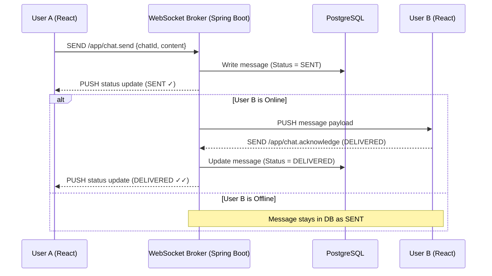

# Functional Specifications Document (FSD)

## Project: WhatsApp Clone with Local AI Integration (Ollama)
**Target Audience:** Frontend Developers, QA Engineers, System Integrators  
**Status:** APPROVED  

---

## 1. User Interface (UI) & User Experience (UX) Layout

The application will feature a three-panel responsive layout styled after modern messaging applications.

```
+---------------------------------------------------------+
| Profile | Search  |  User / Group Header        | AI    |
+---------+---------+-----------------------------+ Panel |
| User 1  [Last msg]| [Message Thread]            |       |
| User 2  [Last msg]|                             | Summary|
| Group A [Last msg]| User A: Hello               | Text...|
|                   | User B: How are you?        |       |
|                   |                             | Tasks:|
|                   |                             | - [ ] |
|                   +-----------------------------+       |
|                   | [Text Input Area]           |       |
+-------------------+-----------------------------+-------+
```

### 1.1. Sidebar Panel (Left)
*   **Profile Section:** Displays current user's profile image, username, and status toggle.
*   **Search Box:** Filters the list of conversations dynamically as the user types.
*   **Conversation List:** Displays active chats (One-to-One and Groups).
    *   Each chat row displays: Avatar, Name, Last Message preview, Timestamp of last message, and Unread Message count.
    *   **Online Indicator:** A small green dot over the user's avatar if they are currently connected (online).
    *   **Typing Indicator:** Displays "typing..." in green text instead of the last message preview when the user is actively typing.

### 1.2. Chat Panel (Center)
*   **Chat Header:** Displays the active contact name/group name, presence status ("Online", "Offline", "Last seen at..."), and a button to open the "AI Summarizer Panel".
*   **Message Window:** Scrollable container displaying message bubbles.
    *   *Left Bubbles:* Received messages (grey).
    *   *Right Bubbles:* Sent messages (green/blue).
    *   *Status Ticks:*
        *   Single grey check (✓): Sent to server.
        *   Double grey check (✓✓): Delivered to recipient.
        *   Double blue check (🔵✓✓): Read by recipient.
*   **Input Footer:** Rich text input field with attachment clips (mocked) and an emoji button. Pressing "Enter" sends the message.

### 1.3. AI Summary Panel (Right - Collapsible)
*   **Header:** Title "AI Conversation Insights" and a close button.
*   **Trigger Button:** "Analyze & Summarize" (calls the local Ollama instance).
*   **Dynamic Progress State:** A loader displaying "AI is reading the chat logs..." during processing.
*   **Insights Display:**
    *   **Summary Section:** Text paragraph summarizing key discussion topics.
    *   **Action Items:** A checklist showing identified tasks (e.g. *"[ ] Rahul to send contract by 5 PM"*).

---

## 2. Core Functional Workflows (Use Cases)

### 2.1. Use Case 1: Messaging Flow (Real-Time)



### 2.2. Use Case 2: Presence Tracking (Heartbeat & Presence)
1.  **Online Detection:** When a client opens the application, it connects to the WebSocket endpoint. On connection, the client publishes its presence to `/app/presence/online`. The backend writes the user ID to Redis with a TTL of 30 seconds.
2.  **Heartbeat Loop:** Every 15 seconds, the client sends a small ping frame to the server to renew its Redis TTL.
3.  **Offline Detection:** If the client disconnects gracefully (WebSocket closes), the backend deletes the user's online key from Redis and saves `last_seen = LocalDateTime.now()` in PostgreSQL. If the connection drops abruptly, the key automatically expires from Redis within 30 seconds.

### 2.3. Use Case 3: Transient Sync AI Summarization
1.  User clicks the **"Analyze & Summarize"** button in the AI Panel.
2.  The React app fetches the last 50 messages from the active chat state.
3.  If the chat is encrypted locally, the React app decrypts the messages in-memory.
4.  React POSTs the message payload to `/api/ai/summarize`.
5.  The backend routes this payload to the local **Ollama** server using `Spring AI`.
6.  The backend streams the output tokens using `SseEmitter` back to the frontend.
7.  Once the stream is complete, the React frontend displays the summarized content, and the backend garbage collector cleans the plaintext messages from memory.

---

## 3. Error Handling and System Resilience

| Failure Scenario | Impact on User | System Recovery Action |
| :--- | :--- | :--- |
| **Local Ollama crashes** | Summarization fails. | Backend catches connection exceptions and returns HTTP 503 with a warning: *"AI services are temporarily unavailable. The core chat remains functional."* |
| **WebSocket disconnects** | Messaging stops, double ticks disappear. | React STOMP client attempts auto-reconnection every 5 seconds. Pending messages typed offline are queued in browser's local state. |
| **PostgreSQL down** | App cannot load chats or verify logins. | Fail-fast validation. System returns HTTP 500 error page. |
| **Redis down** | Typing indicators and Online statuses stop working. | Fallback: System temporarily queries PostgreSQL directly for status updates at a slower interval, or gracefully degrades status icons to "unknown". |
