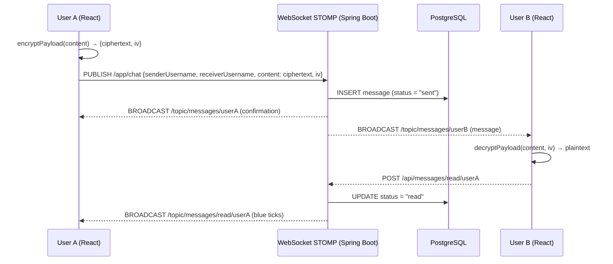

# Functional Specifications Document (FSD)

## Project: Setu Connect — Real-Time Chat with Multi-Provider AI
**Product Name:** Setu Connect  
**Target Audience:** Frontend Developers, QA Engineers, System Integrators  
**Status:** APPROVED (Updated v2.0 — August 2026)  
**Key Change:** Ollama removed as required dependency. Multi-Provider AI: Device → Ollama (optional) → Gemini (cloud fallback). Redis removed — presence handled in-memory.

---

## 1. User Interface (UI) & User Experience (UX) Layout

The application features a two-panel responsive layout (Sidebar + ChatWindow) with a collapsible icon rail.

```
+--+---------------------------+-----------------------------------+
|  | SidebarHeader (logo, +)   |   Chat Header (name, status, 📞)  |
|  +---------------------------+-----------------------------------+
|N | Search Box                |   Message Thread (scrollable)     |
|a |                           |                                   |
|v | User 1 [Last msg] [time]  |   ← [Received: grey bubble]       |
|  | User 2 [Last msg] [time]  |                                   |
|R | Group A [Last msg]        |      [Sent: green bubble] →       |
|a |                           |                                   |
|i | [Active Tab Panel]        |   [AI Panel - expandable]         |
|l |   Chats / Calls / Status  |                                   |
|  |   Analytics / Settings    +-----------------------------------+
|  |                           |   [ Input Bar: 📎 type... 🤖 ➤ ] |
+--+---------------------------+-----------------------------------+
```

### 1.1. Navigation Rail (Far Left, 60px)
*   Icons for: **Chats**, **Calls**, **Status**, **Analytics**, **Settings**
*   Active icon: green `#00a884` filled circle background
*   Click switches the panel content area

### 1.2. Sidebar Panel (300px)
*   **Setu Connect Logo** + green "+" button for new contact/group
*   **Search Box:** Filters contacts dynamically
*   **Chat List:** Contact rows — Avatar (48px), Name, Last Message, Timestamp, Unread Badge (green `#00a884`)
*   **Online Dot:** Small green circle on avatar if contact is online
*   **Typing Indicator:** "typing..." in green instead of last message text
*   **Other Tabs:** Calls panel, Status/Stories panel, Analytics dashboard, Settings panel

### 1.3. Chat Window (Right, flexible width)
*   **Chat Header:** Contact name (white), "Online" status (`#00a884`), audio & video call icon buttons
*   **Message Bubbles:**
    - Sent (right): Background `#005c4b`, border-radius `18px 18px 4px 18px`
    - Received (left): Background `#202c33`, border-radius `18px 18px 18px 4px`
    - Status ticks: ✓ (sent), ✓✓ (delivered), 🔵✓✓ (read)
*   **AI Panel:** Expandable section with 16 AI feature buttons + response area + privacy report
*   **Input Bar:** Background `#2a3942`, text input, attach icon, AI icon, send button (`#00a884`)

---

## 2. Core Functional Workflows (Use Cases)

### 2.1. Authentication Flow
```
User opens app → AuthContext checks localStorage for token
    If token exists → GET /api/users/me → validate → load main UI
    If no token → show Login/Register form

Login:
    POST /api/auth/login {username, password}
    → JWT returned → stored in localStorage
    → isAuthenticated = true → main UI renders

Register:
    POST /api/auth/register {username, email, phoneNumber, password}
    → JWT returned → stored → logged in immediately
```

### 2.2. Messaging Flow (Real-Time, AES-Encrypted)

```mermaid
sequenceDiagram
    participant UserA as User A (React)
    participant WS as WebSocket STOMP (Spring Boot)
    participant DB as PostgreSQL
    participant UserB as User B (React)

    UserA->>UserA: encryptPayload(content) → {ciphertext, iv}
    UserA->>WS: PUBLISH /app/chat {senderUsername, receiverUsername, content: ciphertext, iv}
    WS->>DB: INSERT message (status = "sent")
    WS-->>UserA: BROADCAST /topic/messages/userA (confirmation)
    WS-->>UserB: BROADCAST /topic/messages/userB (message)
    UserB->>UserB: decryptPayload(content, iv) → plaintext
    UserB-->>WS: POST /api/messages/read/userA
    WS->>DB: UPDATE status = "read"
    WS-->>UserA: BROADCAST /topic/messages/read/userA (blue ticks)
```

### 2.3. Presence Tracking (In-Memory, No Redis)
*   **Online Detection:** Client connects WebSocket → PUBLISH `/app/presence/connect` with username → `PresenceService.userOnline(username, sessionId)` stores in `ConcurrentHashMap<sessionId, username>`.
*   **Offline Detection:** WebSocket disconnects → Spring `SessionDisconnectEvent` → `PresenceService.userOffline(sessionId)` → updates `user.lastSeen = now()` in DB.
*   **Status Query:** Frontend polls `GET /api/users/online` every 30 seconds → returns `Set<String>` of online usernames.
*   **Note:** Redis is NOT used. Presence is managed in-memory. On backend restart, all users appear offline until they reconnect.

### 2.4. Typing Indicator Flow
```
User types → debounced event (300ms) →
    PUBLISH /app/chat/typing {senderUsername, receiverUsername, isTyping: true}
    → BROADCAST /topic/typing/{receiverUsername}
    → Receiver's UI shows "typing..." under contact name
    → Auto-clears after 3 seconds (client-side timer)
```

### 2.5. AI Summarization Flow (Multi-Provider)
```
User clicks "Summarize Chat" in AI panel
    → Transcript built from local message state
    → GET /api/ai/preflight → {providerName, isCloud, requiresPermission}
    → If requiresPermission = true → Show privacy permission modal
    → User confirms → POST /api/ai/summarize {text: transcript}
    → Backend: AiProviderManager.selectProvider()
        AUTO mode: DeviceAI? → no → Ollama? → no → Gemini? → yes
    → GeminiAiProvider.generate(promptText)
        → POST https://generativelanguage.googleapis.com/v1beta/models/gemini-1.5-flash:generateContent
        → Parse candidates[0].content.parts[0].text
    → Return AiReportResponse {
        responseText: "Summary...",
        provider: "Gemini",
        processingMode: "Cloud",
        sentOutsideDevice: true,
        temporaryBufferReleased: true,
        processingTimeSeconds: 2.3,
        status: "Completed"
      }
    → Frontend shows summary + privacy report card
```

### 2.6. Voice/Video Call Flow (WebRTC via WebSocket Signaling)
```
Caller clicks Call Button →
    navigator.getUserMedia() → localStream
    → new RTCPeerConnection()
    → PUBLISH /app/call/signal {type: "call-request", callerUsername, callType: "audio"}
    → BROADCAST /topic/calls/{receiverUsername}
    → Receiver: IncomingCallOverlay shown (Accept/Reject)
    → Accept → getUserMedia() → createAnswer() → PUBLISH answer
    → ICE candidates exchanged via /app/call/signal {type: "candidate"}
    → P2P WebRTC connection established

End Call:
    → PUBLISH {type: "call-end"}
    → Both close streams
    → POST /api/calls {receiverUsername, callType, status, durationSeconds}
    → System message appears in chat: "📞 Audio Call • 2:25"
    → Real-time call history update via /topic/callhistory/{username}
```

### 2.7. Group Chat Flow
```
User creates group via GroupModal →
    POST /api/groups {name: "Team Alpha", memberUsernames: ["alice", "bob"]}
    → ChatGroup saved with Set<User> members

Send group message →
    PUBLISH /app/chat {groupId: 5, senderUsername, content, iv}
    → Backend finds group.members
    → BROADCAST /topic/messages/{each member's username}
    → All members receive in real-time
```

---

## 3. Feature Specification Table

| Feature | Trigger | Backend Endpoint | Real-Time? |
|---|---|---|---|
| Register | Form submit | POST /api/auth/register | No |
| Login | Form submit | POST /api/auth/login | No |
| Send Message | Enter key / Send button | WS /app/chat | Yes (STOMP) |
| Receive Message | Auto (subscription) | /topic/messages/{username} | Yes |
| Typing Indicator | Keypress | WS /app/chat/typing | Yes |
| Read Receipts | Open chat | POST /api/messages/read/{sender} | Yes (WebSocket) |
| Voice Call | Call button | WS /app/call/signal | Yes (WebRTC) |
| Video Call | Video button | WS /app/call/signal | Yes (WebRTC) |
| Emoji Reaction | Reaction picker | POST /api/messages/react/{id} | Yes (broadcast) |
| Star Message | Context menu | POST /api/messages/star/{id} | No |
| Pin Message | Context menu | POST /api/messages/pin/{id} | No |
| Delete Message | Context menu (< 15 min) | DELETE /api/messages/{id} | Yes (broadcast) |
| Panic Wipe | Settings > Danger Zone | DELETE /api/messages/panic-wipe | Yes (broadcast all) |
| Add Contact | Search + Add | POST /api/contacts | No |
| Create Group | GroupModal | POST /api/groups | No |
| Post Status | StatusPanel | POST /api/statuses | No |
| Schedule Message | ScheduledModal | POST /api/scheduled | No (auto-send via scheduler) |
| Vanish Mode | VanishModeModal | POST /api/vanish-mode | No |
| Upload Profile Pic | Settings | POST /api/users/profile-image | No |
| AI Summarize | AI Panel | POST /api/ai/summarize | No |
| AI Smart Reply | AI Panel | POST /api/ai/smart-reply | No |
| AI Translate | Context menu | POST /api/ai/translate | No |
| AI Rewrite | Compose bar | POST /api/ai/rewrite | No |
| AI Grammar Fix | Compose bar | POST /api/ai/grammar | No |
| AI Chat Assistant | AIModal | POST /api/ai/chat | No |
| Export Chat | ConversationControl | Client-side | No |
| Universal Search | UniversalSearchModal | Client-side (local state) | No |

---

## 4. Error Handling and System Resilience

| Failure Scenario | Impact on User | System Recovery Action |
|---|---|---|
| **Gemini API key missing/invalid** | AI features unavailable | `/api/ai/preflight` returns `provider: "None"`. UI shows "AI Unavailable" gracefully. Core chat unaffected. |
| **Ollama not running** | Ollama provider unavailable | `OllamaAiProvider.isAvailable()` returns false. AUTO mode skips to Gemini. |
| **All AI providers failed** | No AI response | Returns `AiReportResponse {status: "Unavailable"}`. UI shows friendly error. |
| **WebSocket disconnect** | Real-time messaging stops | STOMP client auto-reconnects every 5 seconds. Offline messages queued in localStorage `offlineMessageQueue`, flushed on reconnect. |
| **PostgreSQL unavailable** | App cannot load data | Spring Boot fails fast. HTTP 500 returned. No data corruption. |
| **File upload too large** | Upload rejected | Backend returns HTTP 400 with message "File size exceeds 5MB limit" |
| **Delete message after 15 min** | Delete rejected | Backend returns HTTP 400 "Delete limit exceeded (max 15 mins)" |
| **Unauthorized API call** | 401 error | JWT filter rejects request. Frontend redirects to login. |
| **Call to offline user** | Call cannot connect | CallContext sets `offlineNotice` → toast banner shown: "User is offline, call recorded as missed" |

---

## 5. Security Specifications

| Security Layer | Implementation |
|---|---|
| Password Storage | BCrypt hashing (Spring Security, salt factor 10) |
| API Authentication | JWT Bearer token (HMAC-SHA256, 24h expiry) |
| WebSocket Auth | JWT validated in STOMP CONNECT frame via Spring Security |
| Message Encryption | AES-256-GCM client-side (cryptoEngine.js), IV per message |
| File Upload | Type validation (JPG/PNG only), size limit (5MB), filename sanitization |
| CORS Policy | WebSocket: specific origins (Vercel URL + localhost). REST: configurable via SecurityConfig |
| Privacy Settings | Server-side enforcement — profile fields redacted based on user's privacy configuration |
| Panic Wipe | Immediate DB purge + real-time broadcast to all affected parties |

---

## 6. AI Provider Configuration Reference

| Setting | Values | Default | Behavior |
|---|---|---|---|
| `preferredProvider` | AUTO, DEVICE, LOCAL, CLOUD | AUTO | Provider selection strategy |
| `askPermissionEveryTime` | true/false | true | Show modal before each cloud AI call |
| `alwaysAllowCloud` | true/false | false | Skip permission check if true |
| `disableCloudAi` | true/false | false | Block ALL cloud AI calls |
| `preferLocalProcessing` | true/false | true | Prefer local over cloud in AUTO mode |
| `neverAutomaticallySendToCloud` | true/false | true | No silent cloud fallback |
| `showPrivacyNoticeBeforeCloud` | true/false | true | Always show privacy warning |
